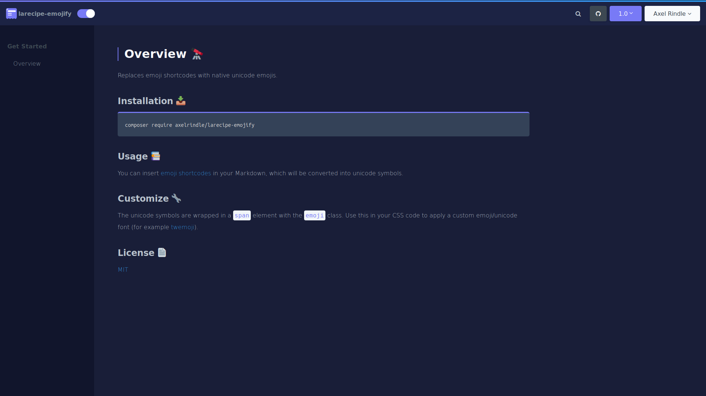

<h6 align="center">
    
</h6>
<h2 align="center">
    larecipe-emojify
</h2>
<h6 align="center">
    Replaces emoji shortcodes with native unicode emojis.
</h6>


## Installation

```bash
composer require axelrindle/larecipe-emojify
```

## Usage

You can insert [emoji shortcodes](https://www.webfx.com/tools/emoji-cheat-sheet/) in your Markdown, which will be converted into unicode symbols.

## Customize

The unicode symbols are wrapped in a `span` element with the `emoji` class. Use this in your CSS code to apply a custom emoji/unicode font (for example [twemoji](https://github.com/eosrei/twemoji-color-font)).

## Screenshot



## License

[MIT](LICENSE)